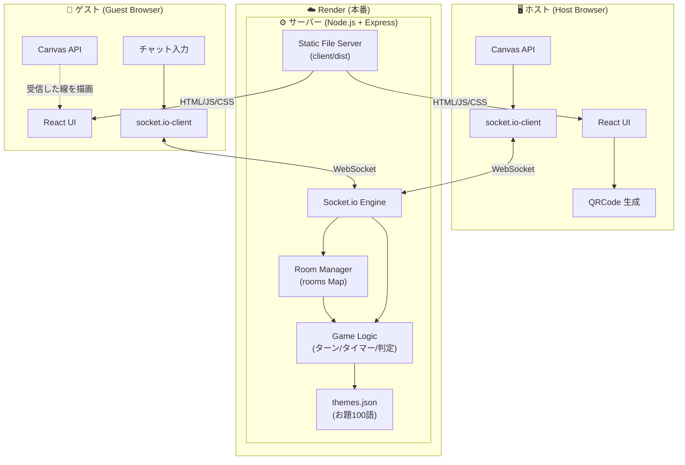
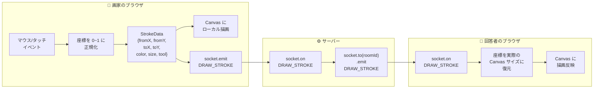
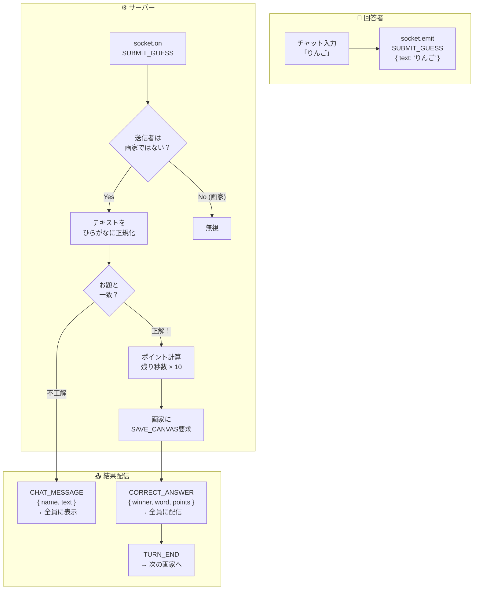
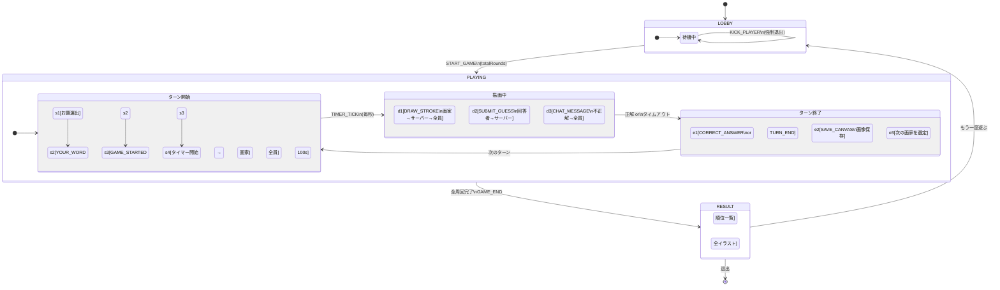
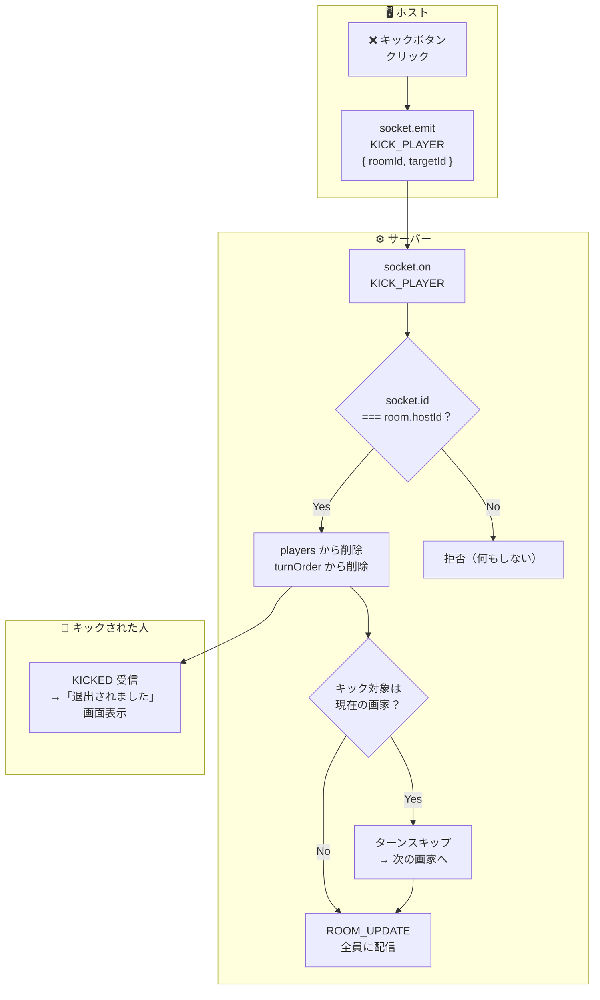
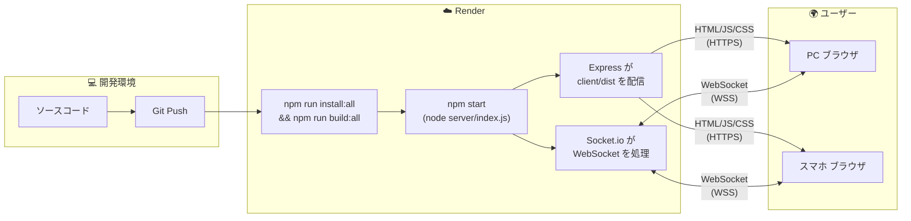

# 📊 DrawDraw データフロー図 (Data Flow Diagrams)

> このドキュメントは DrawDraw アプリにおける **データの流れ** を視覚的にまとめたものです。
> 技術仕様の詳細は `implementation_plan.md` を参照してください。

---

## 1. 全体システムデータフロー

アプリ全体を通じて、データがどのように生成・転送・消費されるかの俯瞰図です。



---

## 2. ルーム作成〜参加のデータフロー

ホストがルームを作り、ゲストがQRコードで参加するまでの流れです。

```mermaid
sequenceDiagram
    actor Host as 🖥️ ホスト
    participant Server as ⚙️ サーバー
    participant RoomMap as 🗄️ rooms Map
    actor Guest as 📱 ゲスト

    rect rgb(30, 41, 59)
        Note over Host, Guest: Phase A: ルーム作成
        Host->>Server: CREATE_ROOM { playerName }
        Server->>RoomMap: 新規Room生成 (ID: 5桁英数字)
        RoomMap-->>Server: Room オブジェクト
        Server-->>Host: ROOM_CREATED { roomId }
        Host->>Host: QRコード生成 (URL: /?room=ID)
    end

    rect rgb(30, 59, 41)
        Note over Host, Guest: Phase B: ゲスト参加
        Guest->>Guest: QRスキャン → URL開く
        Guest->>Server: JOIN_ROOM { roomId, playerName }
        Server->>RoomMap: players配列に追加<br/>turnOrder末尾に追加
        Server-->>Guest: JOIN_SUCCESS { room全体の状態 }
        Server-->>Host: ROOM_UPDATE { 更新後 players }
    end
```



---

## 3. リアルタイム描画のデータフロー

**最もデータ量が多い通信**です。画家の指/マウスの動きを座標データとして毎フレーム送信します。



### 座標の正規化について
```
送信時: fromX = 実際のX座標 / Canvas幅  (0.0 ~ 1.0)
受信時: 実際のX座標 = fromX × Canvas幅
```
> これにより、PCの大画面(800px)で描いた線が、スマホの小画面(360px)でも正しい位置に表示されます。

---

## 4. 回答〜正解判定のデータフロー

回答者のチャット入力がサーバーで判定され、結果が全員に配信される流れです。



---

## 5. ゲーム全体のステート遷移とデータの流れ

ゲームの状態（LOBBY → PLAYING → RESULT）が変わるたびに、どんなデータが生成・消費されるかを示します。



---

## 6. キック（強制退出）のデータフロー



---

## 7. デプロイ時のデータフロー


