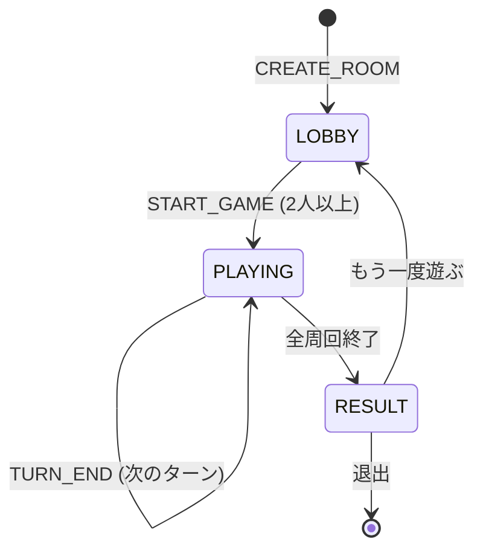
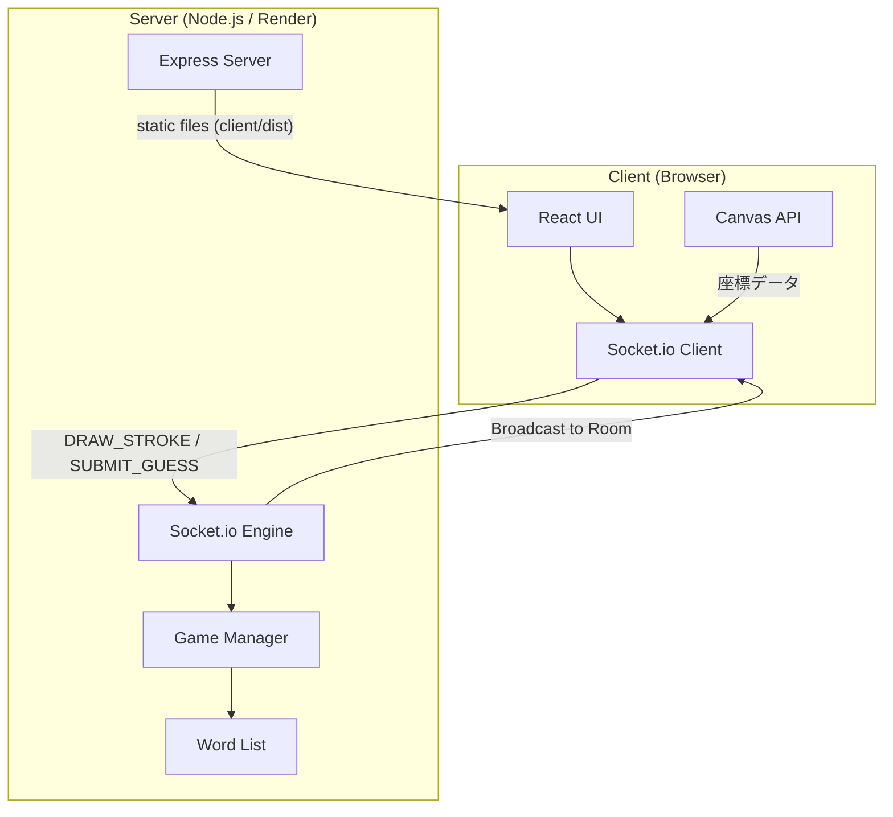
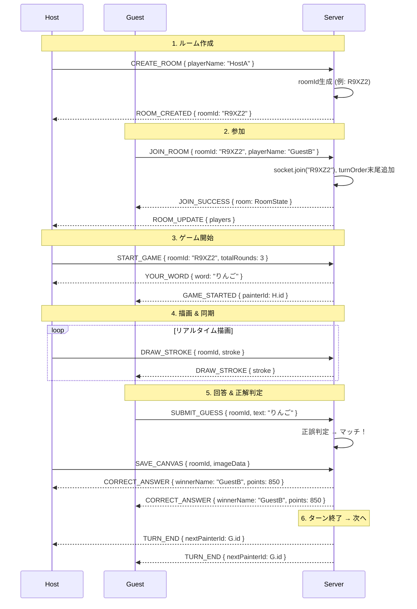
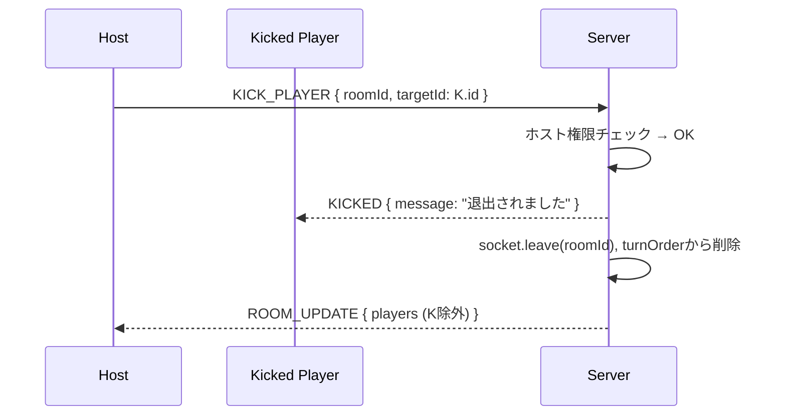

# 🎨 DrawDraw 技術設計・仕様書 (Complete Specification)

> **このドキュメントは自己完結型です。**
> 別のスレッド・別のAIモデル・別の開発者に渡すだけで、追加の文脈なしに開発を継続できるよう設計されています。

---

## 1. プロジェクト概要

### 1.1 アプリ名
**DrawDraw**

### 1.2 概要
Socket.io を活用したリアルタイムお絵描きクイズWebアプリ。親（ホスト）がルームを作成し、他のプレイヤーがQRコードやURL経由で参加する。プレイヤーが順番にお題のイラストを描き、他のプレイヤーがチャットで何の絵か当てるゲーム。

### 1.3 主要ルール
- ホストが「部屋を作成」→ QRコード/URLを共有 → 参加者が入室
- ホストが周回数(n)を設定し、2人以上集まったらゲーム開始可能
- 描く番は「入室順」（ホスト → Player1 → Player2 ...）で回る
- 画家にはランダムなお題が表示され、100秒以内に描く
- 回答者はチャットで推測を入力。正解が出た瞬間にターン終了
- 正解時のポイント: `残り秒数 × 10点` を正解者と画家の両方に付与
- 100秒経過で誰も正解できなければ0ポイントで次のターンへ
- n周回が終了すると最終ランキング＆全員のイラストギャラリーを表示
- 途中参加OK: 描く番のリストの一番後ろに追加される
- ホストは任意のプレイヤーを強制退出（キック）できる
- 複数ルーム同時対応（ルームIDで分離）

---

## 2. 技術スタックと選定理由

| 技術要素 | 選定内容 | 採用理由 |
| :--- | :--- | :--- |
| **Frontend Framework** | **React 18** | コンポーネント指向でCanvas・チャット・スコアボード等の独立UIを効率管理。状態管理が容易。 |
| **Build Tool** | **Vite** | HMR（Hot Module Replacement）が高速で開発効率を最大化。ビルドも極めて高速。 |
| **Styling** | **Vanilla CSS** | フレームワークの制約なく、グラスモーフィズム等のプレミアムデザインを細部まで制御可能。 |
| **Real-time通信** | **Socket.io** | WebSocketラッパー。再接続処理・Room機能が標準装備。描線データの高速送受信に最適。 |
| **Backend** | **Node.js + Express** | フロントと同じJSで記述可能。I/O処理に強く、1プロセスでHTTP配信とWebSocketを兼任。 |
| **描画エンジン** | **HTML5 Canvas API** | ブラウザ標準機能で外部依存なし。描画パフォーマンス最大化。座標データの抽出が軽量。 |
| **QRコード** | **qrcode.react** | Reactコンポーネントとして宣言的にQR表示。クライアントサイド完結で高速生成。 |
| **Icons** | **Lucide React** | モダンで軽量なアイコンセット。ペン・消しゴム・ゴミ箱等の直感的UIに利用。 |
| **演出** | **canvas-confetti** | 正解時の紙吹雪演出。軽量で導入が容易。 |
| **Socket Client** | **socket.io-client** | フロントエンドからSocket.ioサーバーへ接続するためのクライアントライブラリ。 |
| **Deployment** | **Render (Web Service)** | Node.jsアプリを無料枠でホスト可能。GitHubと連携してデプロイが容易。 |

---

## 3. プロジェクト構造

### 3.1 ディレクトリ構成（最終形）
```
draw/                        ← プロジェクトルート
├── package.json             ← ルート（一括ビルド/起動スクリプト）
├── implementation_plan.md   ← この設計書
├── task.md                  ← 開発ロードマップ
│
├── server/                  ← バックエンド
│   ├── package.json
│   ├── index.js             ← Express + Socket.io メインサーバー
│   ├── gameManager.js       ← ゲームロジック（ターン管理、正解判定等）
│   └── themes.json          ← お題ワードリスト
│
└── client/                  ← フロントエンド (Vite + React)
    ├── package.json
    ├── vite.config.js
    ├── index.html
    └── src/
        ├── main.jsx         ← エントリーポイント
        ├── App.jsx          ← ルートコンポーネント（画面切替）
        ├── index.css        ← グローバルスタイル（デザインシステム）
        ├── socket.js        ← Socket.io クライアント接続の共有インスタンス
        └── components/
            ├── Lobby.jsx        ← ルーム作成/参加画面
            ├── GameBoard.jsx    ← ゲームメイン画面（Canvas + Chat + Score）
            ├── Canvas.jsx       ← お絵描きキャンバス
            ├── Toolbar.jsx      ← 描画ツール（色・太さ・消しゴム）
            ├── Chat.jsx         ← チャット/回答入力
            ├── Scoreboard.jsx   ← スコアボード
            ├── Timer.jsx        ← カウントダウンタイマー
            ├── QRDisplay.jsx    ← QRコード表示
            └── Results.jsx      ← 最終ランキング＆ギャラリー
```

### 3.2 現在のプロジェクト状態（Phase 4 バックエンド完了時点）

| ファイル | 実装状態 |
|---|---|
| `server/index.js` | ✅ 完成: CREATE_ROOM / JOIN_ROOM / START_GAME / DRAW_STROKE / CLEAR_CANVAS / SUBMIT_GUESS / SAVE_CANVAS / KICK_PLAYER + startTurn/endTurn |
| `server/gameManager.js` | ✅ 完成: createRoom / joinRoom / leaveRoom / pickWord(重複除外) / saveGalleryItem |
| `server/themes.json` | ✅ 完成: お題100語 |
| `client/src/App.jsx` | ⚠️ 部分実装: ロビー/Canvas直置き画面は動作中。QRコード・KICK実装済み。ゲームイベント（GAME_STARTED等）未接続 |
| `client/src/components/Lobby.jsx` | ✅ 完成 |
| `client/src/components/GameBoard.jsx` | ⚠️ 骨格のみ: Canvas・Toolbar・回答入力・スコア表示あり。App.jsxと未接続・CHAT_MESSAGE履歴表示なし |
| `client/src/components/Canvas.jsx` | ✅ 完成: 正規化座標・履歴復元 |
| `client/src/components/Toolbar.jsx` | ✅ 完成: 12色・4段階太さ・消しゴム |
| `client/src/socket.js` | ✅ 完成 |

**次の実装ステップ**: `App.jsx` で `GameBoard` への切り替えと `GAME_STARTED` / `YOUR_WORD` / `TIMER_TICK` / `CORRECT_ANSWER` / `TURN_END` / `GAME_END` のSocket受信を実装する。

### 3.3 インストール済みパッケージ
- **server**: `express`, `socket.io`, `cors`
- **client**: `react`, `react-dom`, `vite`, `lucide-react`, `qrcode.react`, `canvas-confetti`, `socket.io-client`

### 3.4 重要な注意事項
- Node.js v25 + Express v5 環境。Express v5 では `app.get('*', ...)` は非推奨。`app.get('/{*path}', ...)` を使用すること。
- PowerShell では `&&` でコマンドを繋げられない。`;` を使って区切ること（例: `git commit -m "..." ; git push`）。

---

## 4. データ構造 (Data Models)

### 4.1 サーバーサイド状態管理
サーバーのメモリ上で `Map` を使用してルームを管理する。

```javascript
// rooms: Map<string, Room>
const rooms = new Map();
```

### 4.2 Room
```typescript
interface Room {
  id: string;                   // ルームID (5桁英数字, 例: "R9XZ2")
  hostId: string;               // ホストの Socket ID
  status: 'LOBBY' | 'PLAYING' | 'RESULT';
  players: Player[];            // 入室順の配列
  turnOrder: string[];          // 描画順 (player id の配列)
  currentTurnIndex: number;     // 現在のターンインデックス
  currentWord: string;          // 現在のお題
  round: number;                // 現在の周回数 (1-based)
  totalRounds: number;          // 全周回数
  timeLeft: number;             // 残り秒数 (100 → 0)
  timerInterval: NodeJS.Timer;  // setInterval のリファレンス
  usedWords: string[];          // 既出のお題（重複防止）
  gallery: GalleryItem[];       // 全ターンのイラスト記録
}
```

### 4.3 Player
```typescript
interface Player {
  id: string;        // Socket ID
  name: string;      // プレイヤー名 (入室時に入力)
  points: number;    // 累計スコア
  isHost: boolean;   // ホストフラグ
}
```

### 4.4 GalleryItem
```typescript
interface GalleryItem {
  painterName: string;  // 描いた人の名前
  word: string;         // お題
  imageData: string;    // Canvas.toDataURL() で取得した Base64 画像
  wasGuessed: boolean;  // 正解が出たかどうか
}
```

---

## 5. Socket.io イベント一覧 (Communication API)

### 5.1 クライアント → サーバー

| イベント名 | 送信者 | ペイロード | サーバーの処理 |
| :--- | :--- | :--- | :--- |
| `CREATE_ROOM` | Host | `{ playerName: string }` | 新しいroomIdを生成、rooms Mapに追加、socketをjoin。レスポンス: `ROOM_CREATED` |
| `JOIN_ROOM` | Player | `{ roomId: string, playerName: string }` | 指定roomにsocket.join。turnOrderの末尾に追加。レスポンス: `JOIN_SUCCESS` + 全員に `ROOM_UPDATE` |
| `START_GAME` | Host | `{ roomId: string, totalRounds: number }` | status→PLAYING、最初の画家を決定、お題を選出、タイマー開始。全員に `GAME_STARTED` |
| `DRAW_STROKE` | Painter | `{ roomId: string, stroke: StrokeData }` | roomの他全員にブロードキャスト |
| `CLEAR_CANVAS` | Painter | `{ roomId: string }` | room全員にブロードキャスト |
| `SUBMIT_GUESS` | Guesser | `{ roomId: string, text: string }` | 正誤判定。不正解→全員にチャットメッセージ配信。正解→ポイント計算→`CORRECT_ANSWER`→ターン終了 |
| `KICK_PLAYER` | Host | `{ roomId: string, targetId: string }` | ホスト権限チェック→対象をroom.playersから除去→`KICKED` を対象に送信→全員に `ROOM_UPDATE` |
| `SAVE_CANVAS` | Painter | `{ roomId: string, imageData: string }` | galleryにイラストデータを保存（ターン終了直前に送信） |

### 5.2 サーバー → クライアント

| イベント名 | 送信先 | ペイロード | 説明 |
| :--- | :--- | :--- | :--- |
| `ROOM_CREATED` | Host | `{ roomId: string }` | ルーム作成完了通知 |
| `JOIN_SUCCESS` | Joiner | `{ room: RoomState }` | 入室成功。現在のルーム状態を返す |
| `ROOM_UPDATE` | Room全員 | `{ players: Player[] }` | プレイヤーリスト更新通知 |
| `GAME_STARTED` | Room全員 | `{ painterId: string, round: number, totalRounds: number }` | ゲーム開始通知 |
| `YOUR_WORD` | Painter のみ | `{ word: string }` | お題通知（画家だけに送信） |
| `DRAW_STROKE` | Room (sender除く) | `{ stroke: StrokeData }` | 描線データのリレー |
| `CLEAR_CANVAS` | Room (sender除く) | `void` | キャンバスクリア信号 |
| `CHAT_MESSAGE` | Room全員 | `{ playerName: string, text: string }` | 不正解の回答 or 通常チャット |
| `CORRECT_ANSWER` | Room全員 | `{ winnerId: string, winnerName: string, word: string, points: number }` | 正解通知。全員にお題を公開 |
| `TIMER_TICK` | Room全員 | `{ timeLeft: number }` | 1秒ごとのカウントダウン |
| `TURN_END` | Room全員 | `{ reason: 'correct' \| 'timeout', nextPainterId: string }` | ターン終了と次の画家通知 |
| `GAME_END` | Room全員 | `{ rankings: Player[], gallery: GalleryItem[] }` | 全周回終了。最終結果 |
| `KICKED` | 対象者のみ | `{ message: string }` | 強制退出通知 |

### 5.3 StrokeData 型
```typescript
interface StrokeData {
  fromX: number;   // 始点X (0-1 の正規化座標)
  fromY: number;   // 始点Y
  toX: number;     // 終点X
  toY: number;     // 終点Y
  color: string;   // 色コード (例: "#ff0000")
  size: number;    // 線の太さ (px)
  tool: 'pen' | 'eraser';
}
```
> **注意**: 座標は Canvas の幅・高さに対する 0〜1 の比率で送信する。これにより、異なる画面サイズでも正確に描画を再現できる。

---

## 6. ゲームフロー詳細

### 6.1 ステート遷移


### 6.2 ターンの流れ
1. サーバーが `turnOrder[currentTurnIndex]` のプレイヤーを画家に指名
2. お題をランダム選出（既出を除外）→ 画家にのみ `YOUR_WORD` を送信
3. `TIMER_TICK` を1秒ごとに全員に送信（100→0）
4. 画家が描画 → `DRAW_STROKE` で全員に同期
5. 回答者が `SUBMIT_GUESS` → サーバーが正誤判定
   - **不正解**: `CHAT_MESSAGE` として全員にブロードキャスト
   - **正解**: 残り秒数 × 10 のポイントを正解者と画家に加算 → `CORRECT_ANSWER` → 画家のCanvasをキャプチャ保存 → `TURN_END`
6. タイムアップ（0秒）: 0ポイント → 画家のCanvasをキャプチャ保存 → `TURN_END`
7. `currentTurnIndex++`。全員が1回描いたら `round++`。`round > totalRounds` で `GAME_END`

### 6.3 途中参加
- ゲーム中でも `JOIN_ROOM` 可能
- 新プレイヤーは `turnOrder` の末尾に追加
- 即座に回答者として参加可能
- 描画の番は追加位置に基づく

### 6.4 キック（強制退出）
- ホストのみが実行可能。ロビー中・ゲーム中を問わない
- キックされたプレイヤーが現在の画家の場合: そのターンをスキップして次へ
- キックされたプレイヤーの `turnOrder` からのエントリも削除

### 6.5 正解判定ロジック
- お題とプレイヤーの入力を**ひらがなに変換**して比較（カタカナ・ひらがな両方を許容）
- 完全一致で正解とする
- 画家自身の回答は受け付けない

---

## 7. デザインシステム (Design System)

### 7.1 テーマ
**クリーン・ライトモード** (白と青を基調とした、シンプルで清潔感のあるデザイン)

### 7.2 CSS Variables（設計値）
```css
:root {
  /* 背景 */
  --bg-primary: #ffffff;
  --bg-secondary: #f8fafc; /* 薄いグレー */
  --bg-tertiary: #f1f5f9;

  /* メインアクセント (Blue) */
  --color-primary: #2563eb;
  --color-primary-light: #eff6ff;
  --color-primary-dark: #1d4ed8;
  --accent-gradient: linear-gradient(135deg, #3b82f6, #2563eb);

  /* テキスト */
  --text-primary: #1e293b;   /* 濃い紺色 */
  --text-secondary: #64748b; /* グレー */
  --text-muted: #94a3b8;

  /* 状態カラー */
  --color-success: #22c55e;
  --color-error: #ef4444;
  --color-warning: #f59e0b;

  /* ボーダー・影 */
  --border-color: #e2e8f0;
  --shadow-sm: 0 1px 2px rgba(0, 0, 0, 0.05);
  --shadow-md: 0 4px 6px -1px rgba(0, 0, 0, 0.1), 0 2px 4px -1px rgba(0, 0, 0, 0.06);
  --shadow-lg: 0 10px 15px -3px rgba(0, 0, 0, 0.1);

  /* その他 */
  --font-family: 'Inter', 'Noto Sans JP', sans-serif;
  --radius-md: 12px;
  --radius-lg: 16px;
}
```

### 7.3 カラーパレット（お絵描き用12色）
```javascript
const PALETTE_COLORS = [
  '#000000', // 黒
  '#ffffff', // 白
  '#ef4444', // 赤
  '#f97316', // オレンジ
  '#eab308', // 黄
  '#22c55e', // 緑
  '#06b6d4', // シアン
  '#3b82f6', // 青
  '#8b5cf6', // 紫
  '#ec4899', // ピンク
  '#78716c', // グレー
  '#92400e', // 茶
];
```

### 7.4 ペンサイズ
- 細 (2px), 中 (5px), 太 (10px), 極太 (20px) の4段階スライダー

### 7.5 画面レイアウト

#### ロビー画面
- 中央: アプリロゴ「DrawDraw」、名前入力フォーム、「部屋を作る」/「参加する」ボタン
- ホスト用: QRコード表示、参加者リスト、周回数設定、「ゲーム開始」ボタン、各プレイヤー横にキックボタン

#### ゲーム画面
- ヘッダー: ルームID、タイマー（円形プログレス）、周回数 (例: Round 2/3)
- 左: ツールバー（色パレット、太さスライダー、消しゴム、全消去）※画家のみ表示
- 中央: Canvas（白背景、角丸、シャドウ）
- 右サイドバー: スコアボード（参加者名＋累計ポイント）、チャット＆回答入力欄

#### リザルト画面
- 上部: ランキング表示（1位〜、表彰台アニメーション）
- 下部: ギャラリー（カード形式）: 各ターンのイラスト画像＋お題＋描いた人
- 操作: 「もう一度遊ぶ」/「トップへ戻る」ボタン

---

## 8. URL設計

| パス | 用途 |
|:---|:---|
| `/` | トップページ（ルーム作成/参加） |
| `/?room=R9XZ2` | 参加用直結URL（QRコードの中身） |

- クライアント起動時に `URLSearchParams` で `room` パラメータをチェック
- `room` が存在すれば、自動で名前入力ダイアログ → 入室処理

---

## 9. デプロイ設定 (Render)

| 設定項目 | 値 |
|:---|:---|
| **Runtime** | Node |
| **Build Command** | `npm run install:all && npm run build:all` |
| **Start Command** | `npm start` |
| **Environment Variable** | `PORT` (Render が自動設定) |

> **1プロジェクト構成の利点**: フロントとバックが同一URLになるため、CORS設定が不要。Socket.io の接続先URLも自動で同一オリジンになる。

---

## 10. お題ワードリスト (100語)

### 🥝 食べ物 (20)
りんご, バナナ, イチゴ, スイカ, メロン, 寿司, カレー, ラーメン, ハンバーガー, ピザ, おにぎり, アイスクリーム, パンケーキ, ケーキ, ぶどう, レモン, トマト, なす, パイナップル, 枝豆

### 🦒 動物 (20)
ライオン, ゾウ, キリン, パンダ, ウサギ, ネコ, イヌ, サル, ペンギン, コアラ, トラ, シマウマ, カメ, ヘビ, 魚, クジラ, イルカ, ハムスター, カバ, ワニ

### 🚌 乗り物 (20)
自転車, 車, 飛行機, 船, 新幹線, バイク, ヘリコプター, バス, 救急車, 消防車, パトカー, トラック, ロケット, 潜水艦, 気球, モノレール, ヨット, タクシー, UFO, 戦車

### ✏️ 道具・文房具 (20)
ペン, はさみ, 消しゴム, 定規, カメラ, 電話, パソコン, 眼鏡, 傘, 時計, 鍵, 鞄, 靴, 帽子, 椅子, 机, ベッド, テレビ, 冷蔵庫, 電球

### ⚽ その他 (20)
太陽, 月, 星, 虹, 山, 川, 海, 花, 木, 雪だるま, トランプ, ピアノ, ギター, サッカーボール, 野球, 柔道, 忍者, 桜, お城, 富士山

---

## 11. システムアーキテクチャ図



## 12. シーケンス図

### 12.1 メインゲームフロー


### 12.2 キック（強制退出）

